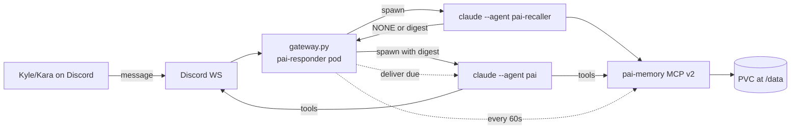

# Pai Improvements — Design Spec

Date: 2026-05-08
Status: Approved (brainstorming → writing-plans)
Wiki companion: `wiki/design-docs/pai-improvements.md`

## Context

Pai is Kyle's personal Discord assistant — a Claude Code agent
(`.claude/agents/pai.md`) running long-lived as a Discord bot via
`infra/ai-agents/pai-responder/` (Deployment, Sonnet, Max OAuth).

Audit of OpenClaw's feature surface
(`wiki/tool-research/openclaw.html`) surfaced four mechanics worth
porting into Pai while staying inside Claude Max OAuth and the
existing K8s patterns:

- Three-tier markdown memory (`MEMORY.md` + daily notes +
  commitments)
- Active recall via a focused sub-agent before each main reply
- Precise commitment scheduling (1-minute resolution)
- Browser automation

The full WHAT and WHY is in the wiki design doc. This spec is the
condensed implementation hand-off.

## Constraints

- Claude harness only; `CLAUDE_CODE_OAUTH_TOKEN` (Max). No
  `ANTHROPIC_API_KEY`, no OpenRouter, no third-party LLMs.
- Token-responsible (Max has quotas).
- K8s-first; per-task CronJobs (no abstractions over scheduling).
- Discord-only; no multi-channel.
- Purpose-built for one user; pick one approach per concern.

## In scope (Tier 1)

1. Replace `pai-memory` MCP v1 (flat JSON) with v2 (markdown-backed,
   richer tool surface).
2. New `pai-recaller` agent definition — minimal, recall-only.
3. `gateway.py` modifications:
   - `recall()` helper that spawns `pai-recaller` and captures the
     digest.
   - Recall digest prepended to main mention prompt as an
     `<active_memory>` block.
   - New `_commitment_tick()` async task running every 60s.
   - Updated MCP config (drops v1 `pai-memory`, adds Playwright,
     keeps Discord/Linear).
4. Pai agent definition (`.claude/agents/pai.md`):
   - Drop v1 memory tools, add v2 memory tools.
   - Add specific `mcp__playwright__*` tools.
   - Add directives for `<active_memory>` handling, scope-aware
     `memory_save`, commitment inscription, daily-vs-long
     decisions, and `memory_promote`.
   - Personality stays inline (no SOUL.md split — see wiki doc for
     why).
5. Add a git-clone init container to pai-responder's Deployment so
   `claude --agent pai` reliably resolves the agent definition at
   runtime.
6. One-shot migration of `/data/memory.json` → `/data/MEMORY.md`,
   idempotent (init container, not a separate Job).
7. Fix the stale `wiki/agent-team/pai.md` (Sonnet, current tools,
   recall + commitments + browser mention).
8. Write `apps/pai/README.md` documenting the architecture and the
   per-task CronJob pattern for future schedules.

## Out of scope

See the wiki doc's "Out of scope" section. Notable: SOUL.md split,
multi-channel, voice, image gen, SKILL.md format, Lobster, custom
embeddings, Honcho/QMD/LanceDB backends, sub-agent orchestration
beyond pai-recaller (Tier 2), unifying the two Discord MCP servers.

## Architecture

## Components

### `pai-memory` MCP v2

- File: `infra/ai-agents/pai-responder/helm/files/memory_mcp.py`
  (rewritten)
- Backing store: `/data/MEMORY.md`,
  `/data/daily/YYYY-MM-DD.md`,
  `/data/COMMITMENTS.md`
- Tools:
  - `memory_save(scope, content, key=None, due=None, precision=None, commitment_scope=None)`
  - `memory_search(query, scope=None, limit=5)` → BM25, hits with
    file/line provenance
  - `memory_recall(query, max_chars=400)` → digest or `NONE`
  - `memory_get(path, lines=None)`
  - `memory_list(scope)` → index per scope
  - `memory_commitment_due(now=None)` → due+pending
  - `memory_commitment_done(id)` → mark delivered
  - `memory_promote(date, line)` → graduate to `MEMORY.md`
- BM25 implemented inline in Python; no external deps beyond what's
  already in the runtime image.
- File formats: see wiki doc for details. `COMMITMENTS.md` uses
  `---`-fenced YAML blocks with `id/status/precision/due/scope/created/source`
  fields and a markdown body. `scope` is `channel:<id>` (delivery
  in a guild channel; mention syntax `<@user-id>` inside `content`
  reaches a specific person). DM-direct delivery is deferred — the
  current Discord MCP doesn't expose `send_dm` and adding it is
  out of scope for Tier 1.

### `pai-recaller` agent

- File: `.claude/agents/pai-recaller.md` (new)
- Model: `sonnet`
- Tools: only `mcp__pai-memory__memory_recall`,
  `mcp__pai-memory__memory_search`,
  `mcp__pai-memory__memory_get`
- Prompt: short. Job is "given a sender + Discord message, return
  `NONE` or a 2–3 line digest of context that meaningfully helps
  the main reply." Strict on `NONE`.

### `gateway.py` changes

- `write_mcp_config()`: drop legacy `pai-memory` entry; add
  Playwright MCP; keep `pai-discord` and `linear-server`.
- New `recall(message_text, sender) -> str | None`: spawns
  `claude --agent pai-recaller -p "Sender: {s}\nMessage: {m}"
  --mcp-config ... --allowedTools "mcp__pai-memory__*"
  --output-format text`. Returns the captured stdout (None if it
  starts with `NONE`).
- `build_mention_prompt`: prepend `<active_memory>{digest}</active_memory>`
  block when digest is non-None.
- `_process_session`: call `recall()` before `invoke_claude()`.
- New async task `_commitment_tick()`: 60-second loop; each tick
  reads due commitments (direct file parse, not MCP — saves a Claude
  invocation), spawns `claude --agent pai -p "Deliver commitment:
  ..."` for each.
- Started alongside existing periodic tasks in `on_ready()`.

### Pai agent definition changes

- File: `.claude/agents/pai.md`
- Tool list updates:
  - Remove: `mcp__pai-memory__memory_save`, `memory_search`,
    `memory_delete`, `memory_list` (v1 signatures)
  - Add: `mcp__pai-memory__memory_save` (v2),
    `memory_search`, `memory_recall`, `memory_get`,
    `memory_list`, `memory_commitment_due`,
    `memory_commitment_done`, `memory_promote`
  - Add: `mcp__playwright__browser_navigate`, `browser_snapshot`,
    `browser_take_screenshot`, `browser_click`,
    `browser_evaluate`, `browser_close`
- System prompt additions:
  - `<active_memory>` block convention.
  - Memory scope decision rules: when to save to `long`, `daily`,
    `commitment`. Format conventions.
  - When/how to use `memory_promote`.
  - Browser tools are for research only; never automate Discord or
    sensitive logged-in pages.
- Personality block stays inline; tighten where it's redundant
  with the new directives.

### pai-responder Deployment changes

- Add init container that runs `git clone` into a shared
  `emptyDir` volume mounted at `/workspace/repo`.
- Main container `cd /workspace/repo` before `python3 /opt/pai/gateway.py`
  so `claude --agent pai` resolves agent definitions from the
  cloned repo.
- Add a second init container running `migrate.py` to convert
  legacy `memory.json` → `MEMORY.md` when present and `MEMORY.md`
  is absent. (Init container, not inline in main entrypoint —
  cleaner separation, easier to reason about exit codes.)
- No PVC schema change; `/data/` continues to hold all state.

### `migrate.py`

- File: `infra/ai-agents/pai-responder/helm/files/migrate.py` (new)
- Idempotent: if `MEMORY.md` exists OR `memory.json` is missing,
  exit 0.
- Otherwise: parse `memory.json`, group by `key`, write `MEMORY.md`
  with `## <key>` sections and timestamped bullets, rename
  `memory.json` → `memory.json.bak.<ts>`.

### `apps/pai/README.md`

- Architecture diagram (same Mermaid as wiki doc, simplified).
- File layout reference.
- "How to add a scheduled task" walkthrough (copy `pai-morning.yaml`).
- "How memory works" cheat-sheet.
- Pointers to the wiki design doc for the WHY.

### Wiki entry fix

- File: `apps/blog/blog/markdown/wiki/agent-team/pai.md`
- Model: Sonnet (not Haiku).
- Tools table: current (no Bash, no Write at the file level — but
  v2 memory tools and Playwright now listed).
- Add brief mention of recall pattern, commitment delivery, and
  browser. Link to the new design doc.
- Bump `last_verified` to today.

## Data flow

### Discord mention

1. Discord WS → `on_message` → enqueue in `SessionQueue`
2. `_process_session` acquires lock
3. **Recall**: `gateway.py` spawns `pai-recaller` with the message
4. Recaller calls `memory_recall` (and possibly `memory_search`)
   via MCP, returns `NONE` or digest
5. `gateway.py` builds main prompt with optional `<active_memory>`
   block prepended
6. **Main**: spawns `claude --agent pai` with full transcript +
   active memory + tools
7. Pai responds via Discord MCP
8. Transcript updated, watermark saved

### Commitment delivery

1. `_commitment_tick` wakes every 60s
2. Reads `/data/COMMITMENTS.md`, finds entries with
   `status=pending AND due<=now`
3. For each: `claude --agent pai -p "Deliver commitment:
   {id, scope, content, precision}"` with allowed tools
   `mcp__pai-discord__send_message`,
   `mcp__pai-discord__create_thread`,
   `mcp__pai-memory__memory_commitment_done`
4. Pai posts to Discord, calls `memory_commitment_done(id)`
5. MCP rewrites COMMITMENTS.md with `status=delivered`

### Memory write from chat

1. Pai decides to remember something
2. Calls `memory_save(scope='long', content='...', key='Kyle')`
3. MCP appends to `MEMORY.md` under `## Kyle` with timestamp

## Error handling

- Recaller failures (timeout, non-zero exit, garbage output): treat
  as `NONE`, log warning, proceed to main without `<active_memory>`
  block.
- Main Pai failures: existing single-retry logic in
  `_process_session` is preserved.
- Commitment delivery failure: log error, leave commitment as
  pending so next tick retries. Add a `retries` counter; after 3
  consecutive failures, mark `status=error` to stop retrying.
- Migration failure: don't crash the pod; log error and leave
  legacy `memory.json` in place. Pai keeps using v1 path until
  resolved (if MCP v2 falls back to empty MEMORY.md, that's a
  graceful degrade).
- MCP server crash: existing pai-responder tolerates this — the
  Claude invocation just fails.

## Testing

- **Unit (Python, in pai-responder helm/files)**: BM25 scoring,
  COMMITMENTS.md parser/writer round-trip, migration idempotency.
  Use `pytest`, runnable locally with `python3 -m pytest`.
- **Integration (in-pod or `kubectl exec`)**: spawn pai-recaller
  with a known message and assert it returns either `NONE` or a
  short digest. Verify `memory_save(scope='commitment', ...)`
  produces a parseable block. Verify `_commitment_tick` delivers a
  test commitment and marks it done.
- **End-to-end (Discord)**: with a personal scratch channel, send a
  mention that should trigger non-`NONE` recall (e.g. about a topic
  pre-saved in MEMORY.md), verify the reply incorporates the recall.
  Send a "remind me in 2 minutes" message, verify delivery within
  60s of due time.

Per `apps/blog/CLAUDE.md`: do not rely on merge-and-deploy. Build
and `kubectl apply` to test.

## Tasks (for writing-plans)

These are intentionally chunked so writing-plans can sequence them
with dependencies and acceptance criteria.

### T1 — `pai-memory` MCP v2 implementation

- Rewrite `memory_mcp.py` with the new tool surface
- Implement BM25 scorer
- Implement COMMITMENTS.md YAML-block parser/writer
- Implement MEMORY.md section-based parser/writer
- Implement daily-note appender with date rotation
- Add unit tests
- Acceptance: all v2 tools work end-to-end against fixture files;
  tests pass

### T2 — Migration script

- `migrate.py` JSON → MEMORY.md, idempotent
- Tests: legacy fixture migrates correctly; running twice is a
  no-op; missing legacy is a no-op
- Acceptance: tests pass

### T3 — `pai-recaller` agent definition

- New `.claude/agents/pai-recaller.md` with sonnet model and
  recall-only tools
- Strict prompt for `NONE`-preferring behavior
- Acceptance: Reviewing the prompt with the standard "would Claude
  follow this" check; agent loads when invoked

### T4 — `gateway.py` modifications

- `recall()` helper
- `<active_memory>` injection in `build_mention_prompt`
- `_commitment_tick()` async task
- Update `write_mcp_config()` (drop v1 pai-memory, add Playwright)
- Wire all the above into `PaiBot.on_ready()`
- Acceptance: Local syntax check; recall path returns digest or
  None correctly; commitment tick delivers test fixture.

### T5 — Pai agent definition update

- `.claude/agents/pai.md` tools list updated
- System prompt directives added (active_memory, scope rules,
  promote, browser)
- Personality preserved, tightened where redundant
- Acceptance: Pai's tool list matches v2 MCP exactly; no orphaned
  tool refs; stale mentions of old behavior removed

### T6 — pai-responder Deployment changes

- Add git-clone init container (workspace emptyDir, clone main)
- Set main container's working dir to `/workspace/repo`
- Add migration init container (or inline in main entrypoint)
- Acceptance: Pod comes up cleanly, gateway logs show "agent pai
  found" on first claude invocation, MEMORY.md exists at /data/

### T7 — `apps/pai/README.md`

- Architecture overview, file layout, "how to add a schedule"
- Pointer to wiki design doc

### T8 — Stale wiki entry fix

- `wiki/agent-team/pai.md` updated (Sonnet, real tools, recall
  mention, last_verified bump)

### T9 — Build and deploy verification

- Helm template the chart locally; diff with current
- `kubectl apply` (per `CLAUDE.md`'s "Testing without merging" rule)
- Smoke-test in personal scratch channel
- Acceptance: pod ready, recall demonstrably works, commitment
  delivery demonstrably works on a 2-minute test commitment

## Open verifications during implementation

(Same list as wiki doc; reproduced here so writing-plans can scope
spike tasks if needed.)

1. Does `claude --agent pai` resolve the agent in pai-responder
   today? Determine via debug pod or quick patch test. Either way,
   T6's git-clone init container fixes it.
2. Does `mcp__playwright__*` work cleanly in the headless K8s
   environment? If not, gate Playwright to non-pod contexts and
   document.
3. Confirm Vault has `claude_oauth_token` at `secret/ai-agents/pai`
   (already known yes for pai-morning).
4. PVC `/tmp/pai-state` hostPath mode after Lima VM rebuild
   (existing gotcha documented in agent-controller wiki).

## Refs

- Wiki design doc:
  `apps/blog/blog/markdown/wiki/design-docs/pai-improvements.md`
- OpenClaw inventory:
  `apps/blog/blog/markdown/wiki/tool-research/openclaw.md`
- Stale Pai wiki entry:
  `apps/blog/blog/markdown/wiki/agent-team/pai.md`
- Existing Pai agent: `.claude/agents/pai.md`
- Existing pai-responder: `infra/ai-agents/pai-responder/`
- Existing cron pattern:
  `infra/ai-agents/cronjobs/helm/templates/pai-morning.yaml`
- Hardened IaC PRD (notes OpenClaw retirement):
  `apps/blog/blog/markdown/wiki/prds/hardened-iac-bootstrap.md`
