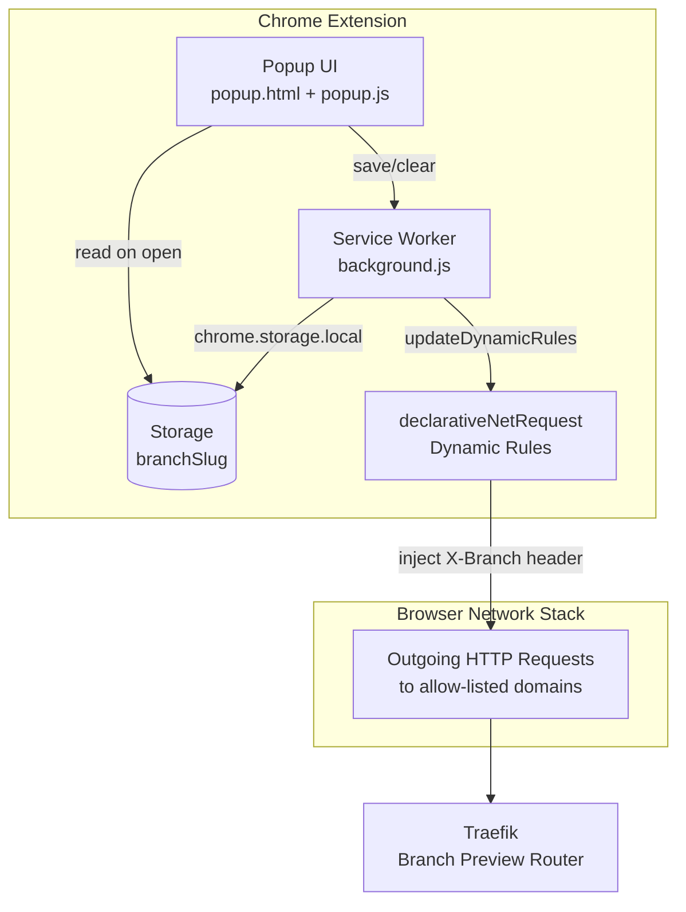

## Context

Link to PRD: [Branch Header Chrome Extension PRD](PRD.md)

Chrome's Manifest V3 introduced `declarativeNetRequest` as the
replacement for the `webRequest` blocking API. The technical challenge
is confirming that MV3's declarative API supports the specific pattern
this extension needs: dynamically adding and removing a single custom
request header (`X-Branch`) based on user input, scoped to a
configurable domain allow-list. The PRD exists because ModHeader, the
current solution, has had malware incidents and requests unnecessarily
broad permissions.

## Goals and Non-Goals

**Goals:**

- Inject `X-Branch: <slug>` header on requests to allow-listed domains
  using `chrome.declarativeNetRequest` dynamic rules
- Persist the branch slug across browser restarts via
  `chrome.storage.local`
- Provide a popup UI with text input, Save, and Clear
- Request only the minimum permissions needed (host permissions scoped
  to the allow-list, no `<all_urls>`)
- Make zero external network calls

**Non-Goals:**

- No arbitrary header editing (single header: `X-Branch`)
- No per-tab or per-site configuration
- No git integration or automatic branch detection
- No Chrome Web Store publishing or packaging
- No Firefox/Safari support
- No UI for editing the domain allow-list (code-level constant)
- No badge or icon state indication (deferred)

## Proposed Design

### Architecture Overview



**Data flow — Save:**

1. User types slug in popup, clicks Save
2. `popup.js` sends a message to the service worker with the slug
3. Service worker writes slug to `chrome.storage.local`
4. Service worker calls `chrome.declarativeNetRequest.updateDynamicRules`
   to add a rule that sets the `X-Branch` header on matching domains
5. All subsequent requests to allow-listed domains include the header

**Data flow — Clear:**

1. User clicks Clear (or saves empty string)
2. `popup.js` sends a message to the service worker with an empty slug
3. Service worker removes slug from `chrome.storage.local`
4. Service worker calls `updateDynamicRules` with `removeRuleIds: [1]`
   and empty `addRules` — no header is injected

**Data flow — Popup open:**

1. `popup.js` reads `branchSlug` from `chrome.storage.local`
2. Populates the text input with the current value (or empty)

### Component Details

#### manifest.json

- **Responsibility:** Extension metadata, permissions, service worker
  registration
- **File path:** `apps/branch-header-extension/manifest.json`
- **Key fields:**
  - `manifest_version: 3`
  - `permissions: ["declarativeNetRequest", "storage"]`
  - `host_permissions`: constructed from the domain allow-list
    (e.g., `"*://*.pericak.com/*"`, `"*://localhost/*"`,
    `"*://127.0.0.1/*"`)
  - `background.service_worker: "background.js"`
  - `action.default_popup: "popup.html"`

#### background.js — Service Worker

- **Responsibility:** Receives messages from the popup, manages storage,
  creates/removes declarativeNetRequest dynamic rules
- **File path:** `apps/branch-header-extension/background.js`
- **Key interface:**

```
Message protocol (chrome.runtime.onMessage):

  { action: "setBranch", slug: string }
    → Writes slug to storage, adds dynamic rule
    → Responds: { ok: true }

  { action: "clearBranch" }
    → Removes slug from storage, removes dynamic rule
    → Responds: { ok: true }
```

- **Dynamic rule structure:**

```
Rule ID: 1 (single rule, constant ID for easy removal)

{
  id: 1,
  priority: 1,
  action: {
    type: "modifyHeaders",
    requestHeaders: [{
      header: "X-Branch",
      operation: "set",
      value: <slug>
    }]
  },
  condition: {
    requestDomains: <ALLOWED_DOMAINS>,
    resourceTypes: [
      "main_frame", "sub_frame", "stylesheet", "script",
      "image", "font", "object", "xmlhttprequest", "ping",
      "media", "websocket", "webtransport", "webbundle", "other"
    ]
  }
}
```

- **On install/startup:** Reads storage; if a slug exists, re-applies
  the dynamic rule (handles service worker restarts and browser restarts)

#### popup.html + popup.js — Popup UI

- **Responsibility:** Text input for branch slug, Save and Clear buttons
- **File paths:** `apps/branch-header-extension/popup.html`,
  `apps/branch-header-extension/popup.js`
- **Behavior:**
  - On open: reads `branchSlug` from `chrome.storage.local`, populates
    input
  - Save button: sends `setBranch` message with trimmed input value;
    if input is empty, sends `clearBranch` instead
  - Clear button: clears input, sends `clearBranch` message

#### config.js — Domain Allow-List

- **Responsibility:** Single source of truth for allowed domains
- **File path:** `apps/branch-header-extension/config.js`
- **Contents:** Exports (or defines) the `ALLOWED_DOMAINS` array.
  Both `background.js` and `manifest.json` host_permissions derive
  from this list.

```
Default allow-list:
  ["pericak.com", "localhost", "127.0.0.1"]
```

Note: `declarativeNetRequest`'s `requestDomains` field automatically
matches subdomains. Listing `pericak.com` matches `pai.pericak.com`,
`api.pai.pericak.com`, etc. This is the desired behavior per Kyle's
confirmation and eliminates the PRD's open question about subdomain
matching.

### Data Model

Single key in `chrome.storage.local`:

| Key | Type | Description |
|-----|------|-------------|
| `branchSlug` | `string \| undefined` | Current branch slug. Absent or empty means no header injection. |

### API / Interface Contracts

**popup.js -> background.js** (via `chrome.runtime.sendMessage`):

| Message | Response | Side effects |
|---------|----------|--------------|
| `{ action: "setBranch", slug: "feature-xyz" }` | `{ ok: true }` | Writes to storage, adds dynamic rule |
| `{ action: "clearBranch" }` | `{ ok: true }` | Removes from storage, removes dynamic rule |

**background.js -> chrome.declarativeNetRequest**:

| Method | When called |
|--------|-------------|
| `updateDynamicRules({ removeRuleIds: [1], addRules: [rule] })` | On setBranch |
| `updateDynamicRules({ removeRuleIds: [1] })` | On clearBranch |

The `removeRuleIds: [1]` is always included in both operations to
ensure idempotency — removing a non-existent rule ID is a no-op.

## Alternatives Considered

### Decision: declarativeNetRequest vs webRequest for header injection

| Option | Pros | Cons | Verdict |
|--------|------|------|---------|
| `declarativeNetRequest` (dynamic rules) | MV3-native, no background page needed, lower permissions, Chrome-recommended path, rules persist across service worker restarts | Slightly more complex rule management, `append` operation limited to specific headers (but `set` works for custom headers) | **Chosen** — It is the MV3-recommended API, requires fewer permissions, and the `set` operation on `modifyHeaders` supports custom headers like `X-Branch`. Dynamic rules via `updateDynamicRules` allow runtime changes without static rule files. |
| `webRequest.onBeforeSendHeaders` | Simpler imperative code, familiar from MV2 | Requires `webRequestBlocking` permission (broader), deprecated pattern in MV3, Chrome may remove blocking webRequest for MV3 extensions entirely | Rejected — Goes against MV3 direction, requires broader permissions, and may break in future Chrome versions. |

### Decision: Message passing vs direct storage access from popup

| Option | Pros | Cons | Verdict |
|--------|------|------|---------|
| Popup sends messages to service worker, service worker manages storage and rules | Clean separation of concerns, service worker is single source of truth for rule state, no race conditions | Slightly more code than direct access | **Chosen** — Keeps rule management centralized in the service worker. The popup only reads storage for display on open. |
| Popup writes to storage directly, service worker listens for storage changes | Fewer messages, popup is self-contained | Two writers to storage, storage change listener adds indirection, harder to reason about rule state | Rejected — Two writers and event-driven rule updates create unnecessary complexity for a simple extension. |

### Decision: Domain allow-list in config.js vs hardcoded in manifest.json

| Option | Pros | Cons | Verdict |
|--------|------|------|---------|
| `config.js` module with domain array, referenced by `background.js`; `manifest.json` host_permissions manually kept in sync | Single source of truth for runtime behavior, easy to update | `manifest.json` host_permissions must be updated manually in sync (but this only changes when domains are added/removed, which is rare) | **Chosen** — The runtime domain list lives in one file. The manifest duplication is acceptable since domain list changes are infrequent. |
| Domains only in `manifest.json`, parsed at runtime | True single source | Extensions cannot easily read their own manifest at runtime in MV3 service workers; would need `fetch` of the manifest file | Rejected — Unnecessarily complex for a static list. |

### Decision: Subdomain matching behavior

| Option | Pros | Cons | Verdict |
|--------|------|------|---------|
| Use `requestDomains` which auto-matches subdomains | Covers `pai.pericak.com`, `api.pai.pericak.com`, etc. with a single `pericak.com` entry; matches how host_permissions wildcards work | Cannot exclude specific subdomains (not needed) | **Chosen** — `declarativeNetRequest`'s `requestDomains` inherently matches subdomains. This is the correct behavior since all subdomains of `pericak.com` are Kyle's infrastructure. |
| Use `urlFilter` with exact domain patterns | Fine-grained control per subdomain | Verbose, requires a rule per subdomain or complex patterns | Rejected — Unnecessary complexity. |

## File Change List

| Action | File | Rationale |
|--------|------|-----------|
| CREATE | `apps/branch-header-extension/manifest.json` | Extension metadata, permissions, service worker and popup registration |
| CREATE | `apps/branch-header-extension/config.js` | Domain allow-list constant, single source of truth |
| CREATE | `apps/branch-header-extension/background.js` | Service worker: message handling, storage, dynamic rule management |
| CREATE | `apps/branch-header-extension/popup.html` | Popup UI markup: text input, Save button, Clear button |
| CREATE | `apps/branch-header-extension/popup.js` | Popup logic: read storage on open, send messages on Save/Clear |

## Task Breakdown

### TASK-001: Create manifest.json and config.js

- **Requirement:** PRD scope — Chrome Manifest V3 extension with
  declarativeNetRequest and scoped host permissions
- **Files:** `apps/branch-header-extension/manifest.json`,
  `apps/branch-header-extension/config.js`
- **Dependencies:** None
- **Acceptance criteria:**
  - [ ] `manifest.json` has `manifest_version: 3`
  - [ ] Permissions include `declarativeNetRequest` and `storage`
  - [ ] `host_permissions` are scoped to allow-list domains only (no `<all_urls>`)
  - [ ] `host_permissions` include `*://*.pericak.com/*`, `*://localhost/*`, `*://127.0.0.1/*`
  - [ ] Service worker registered as `background.js`
  - [ ] Default popup registered as `popup.html`
  - [ ] `config.js` exports/defines `ALLOWED_DOMAINS` array with `["pericak.com", "localhost", "127.0.0.1"]`
  - [ ] Extension loads in Chrome without errors via chrome://extensions (unpacked)

### TASK-002: Implement service worker (background.js) `[P]`

- **Requirement:** PRD stories — Set a branch for preview routing,
  Clear the branch header, Never send empty header
- **Files:** `apps/branch-header-extension/background.js`
- **Dependencies:** TASK-001
- **Acceptance criteria:**
  - [ ] Handles `setBranch` message: writes slug to `chrome.storage.local`, calls `updateDynamicRules` to add rule with `X-Branch` header set to slug value
  - [ ] Handles `clearBranch` message: removes slug from storage, calls `updateDynamicRules` with `removeRuleIds: [1]` and no `addRules`
  - [ ] Empty slug in `setBranch` is treated as `clearBranch` (never creates a rule with empty header value)
  - [ ] On service worker startup (`chrome.runtime.onInstalled` and `chrome.runtime.onStartup`): reads storage, re-applies rule if slug exists
  - [ ] Dynamic rule uses `requestDomains` from `config.js` allow-list
  - [ ] Dynamic rule includes all relevant `resourceTypes`
  - [ ] Rule ID is constant (1) for idempotent add/remove

### TASK-003: Implement popup UI (popup.html + popup.js) `[P]`

- **Requirement:** PRD stories — Set a branch (text input + Save),
  Clear the branch header (Clear button), popup shows current value
- **Files:** `apps/branch-header-extension/popup.html`,
  `apps/branch-header-extension/popup.js`
- **Dependencies:** TASK-001
- **Acceptance criteria:**
  - [ ] `popup.html` contains a text input, a Save button, and a Clear button
  - [ ] On popup open, `popup.js` reads `branchSlug` from `chrome.storage.local` and populates the input
  - [ ] Save button sends `setBranch` message with trimmed input value to service worker
  - [ ] Save with empty input sends `clearBranch` message instead
  - [ ] Clear button clears the input field and sends `clearBranch` message
  - [ ] No external resources loaded (no CDNs, no remote CSS/JS)
  - [ ] Popup is visually functional (minimal inline CSS is acceptable)

### TASK-004: End-to-end verification

- **Requirement:** PRD acceptance criteria — header present on
  allow-listed domains, absent on others, persists across restart,
  no empty header sent
- **Files:** None (testing only)
- **Dependencies:** TASK-002, TASK-003
- **Acceptance criteria:**
  - [ ] Load extension unpacked in Chrome, no errors on chrome://extensions
  - [ ] Save "feature-xyz" — requests to `pai.pericak.com` include `X-Branch: feature-xyz` (DevTools Network tab)
  - [ ] Requests to non-allow-listed domains (e.g., `google.com`) do NOT include `X-Branch`
  - [ ] Close and reopen browser — popup still shows "feature-xyz" and header is still injected
  - [ ] Click Clear — header is no longer sent, no empty `X-Branch` header appears
  - [ ] Save empty string — behaves identically to Clear
  - [ ] Extension makes zero external network calls (DevTools Network tab filtered to extension origin)

## Implementation Additions

(None yet — to be filled during implementation.)

## Open Questions

- **localhost behavior:** Chrome sometimes treats `localhost` and
  `127.0.0.1` differently for extension permissions. The manifest
  includes both as separate host_permissions entries. Needs
  verification during TASK-004 that header injection works for both.

## Risks

- **Service worker lifecycle:** MV3 service workers can be terminated
  by Chrome after inactivity. Mitigation: Dynamic rules persist
  independently of the service worker — they are stored by Chrome
  itself and remain active even when the service worker is inactive.
  The `onInstalled`/`onStartup` handlers are a safety net, not the
  primary persistence mechanism.
- **declarativeNetRequest rule limits:** Chrome allows up to 30,000
  dynamic rules. This extension uses exactly 1. No risk here.
- **manifest.json and config.js domain sync:** The domain allow-list
  appears in two places (config.js for runtime, manifest.json for
  host_permissions). If they drift, the extension may have permission
  to inject headers on domains not in the runtime list, or vice versa.
  Mitigation: The list changes rarely (personal infrastructure only),
  and a comment in both files references the other as the sync point.
